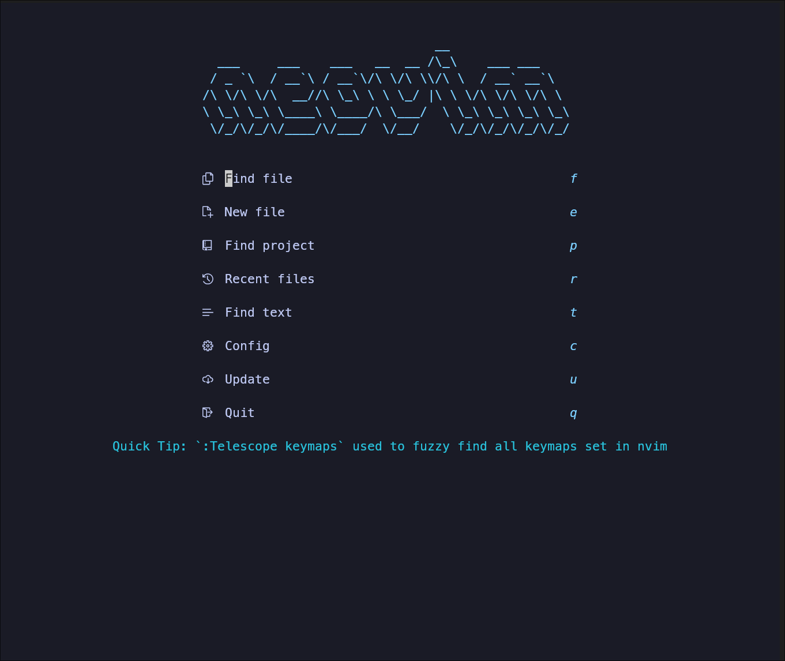

# Neovim Configuration

A feature-rich Neovim configuration using Lua and Lazy as the package manager.


_Dashboard with quick actions and keybindings_

## Features

- 🔥 Fast startup with lazy loading plugins
- 🧩 Modern UI with custom components
- 🌳 File explorer with nvim-tree
- 🔍 Fuzzy finding with Telescope
- 📊 Git integration (blame, signs, diffs)
- 🧠 LSP configurations for multiple languages
- 🎨 Code highlighting with Treesitter
- 🤖 Autocompletion with nvim-cmp
- 🐞 Debugging with DAP
- ⚡ Navigation with Hop and Harpoon
- 📝 Note taking with Todo-comments
- 📦 Terminal integration with Toggleterm
- 🔄 Session management
- 🔧 Powerful custom functions

## Requirements

- Neovim >= 0.11.1
- Git
- Node.js (for LSP servers)
- Python 3
- Rust (for some tools)
- A Nerd Font installed and configured in your terminal

## Installation

1. Backup your existing Neovim configuration (if any):

   ```bash
   mv ~/.config/nvim ~/.config/nvim.bak
   ```

2. Clone this repository:

   ```bash
   git clone https://github.com/blackflame007/nvim.git ~/.config/nvim
   ```

3. Install required dependencies:

   ```bash
   # Install language servers and tools
   npm install -g typescript typescript-language-server pyright vscode-langservers-extracted
   cargo install stylua
   ```

4. Start Neovim:

   ```bash
   nvim
   ```

   On first startup, Lazy.nvim will automatically bootstrap itself and install all plugins.

5. After installation, you can run `:Lazy sync` to ensure all plugins are up to date.

6. Run a health check to verify everything is working:

This will check for missing dependencies and configurations.

   ```bash
   :checkhealth
   ```

## Structure

```
.
├── init.lua                # Main entry point that loads all modules
├── lua/nvim/               # Main configuration directory
│   ├── lazy.lua            # Plugin manager with plugin specifications
│   ├── keymaps.lua         # Key mappings
│   ├── options.lua         # Neovim options
│   ├── colorscheme.lua     # Color scheme settings
│   ├── lsp/                # LSP configurations
│   ├── autocommands.lua    # Autocommands
│   ├── cmp.lua             # Completion setup
│   ├── treesitter.lua      # Treesitter configuration
│   ├── telescope.lua       # Telescope configuration
│   ├── dap.lua             # Debugging setup
│   ├── whichkey.lua        # Which-key mappings
│   └── various plugins...   # Other plugin configurations
└── after/                  # Files loaded after plugins
```

## Customization

- Colors and theme settings are in `lua/nvim/colorscheme.lua`
- Key mappings are defined in `lua/nvim/keymaps.lua`
- Plugin configurations are in their respective files under `lua/nvim/`
- LSP configurations are in the `lua/nvim/lsp` directory

## Key Features Explained

### Plugin Management

Using Lazy.nvim for efficient, lazy-loaded plugin management.

### LSP Support

Configured for multiple languages with intelligent code navigation, diagnostics, and autocompletion.

### Customizable UI

Status line, buffer line, and various UI elements that provide useful information while staying minimal.

### Terminal Integration

Toggleable terminal with custom settings and keybindings.

### Git Integration

Git blame, signs, diff view, and various Git operations right from the editor.

## Troubleshooting

- If you encounter issues with plugins, try running `:Lazy sync`
- For LSP issues, check `:LspInfo` and `:LspLog`
- For Treesitter problems, run `:TSUpdate` and `:TSInstallInfo`

## Contributing

Contributions are welcome! Please feel free to submit a Pull Request.

## License

This project is licensed under the MIT License - see the LICENSE file for details.
